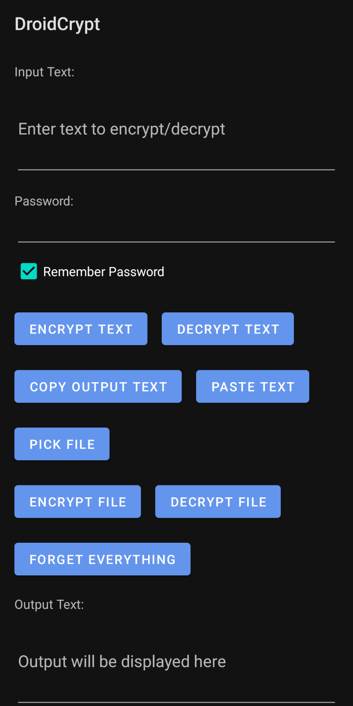

# DroidCrypt

<!-- DESCRIPTION -->
## Description:

File and text encryption in Android offers crucial benefits in protecting sensitive data. By encrypting files and text, users can prevent unauthorized access, ensuring confidentiality and privacy. This is especially vital in a world where mobile devices often contain personal, financial, and business-related information. Encryption adds an additional layer of security, preventing malicious actors from intercepting or tampering with data, thus mitigating the risk of data breaches and identity theft. 

<!-- FEATURES -->
## Features:

- Uses AES-256-GCM for encryption

- Uses Scrypt for key derivation with CPU/Memory cost of 32768, block size of 16, and parallelization of 4

- Built in Java

<!-- INSTALLATION -->
## Installation:

### Option 1:

### Option 2:

Download the latest APK from the [Releases Section](https://github.com/umutcamliyurt/DroidCrypt/releases/latest).

### Option 3:

Build it yourself using [Android Studio](https://developer.android.com/studio).

<!-- SCREENSHOTS -->
## Screenshots:

<!-- LICENSE -->
## License

Distributed under the MIT License. See `LICENSE` for more information.
